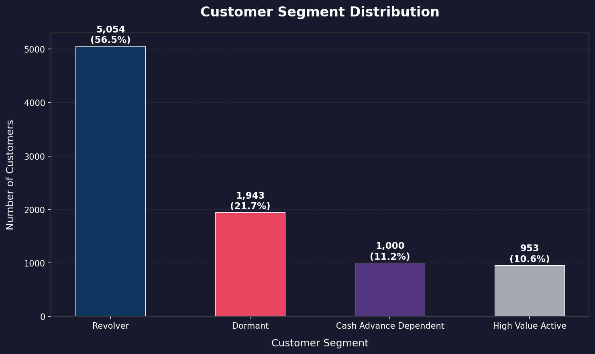
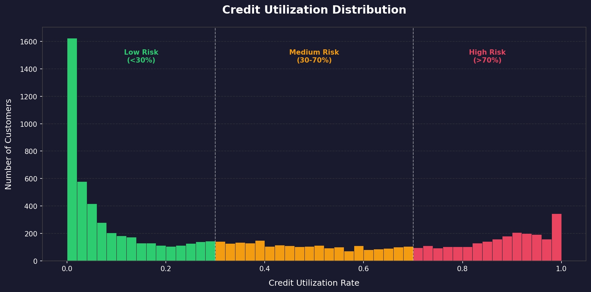
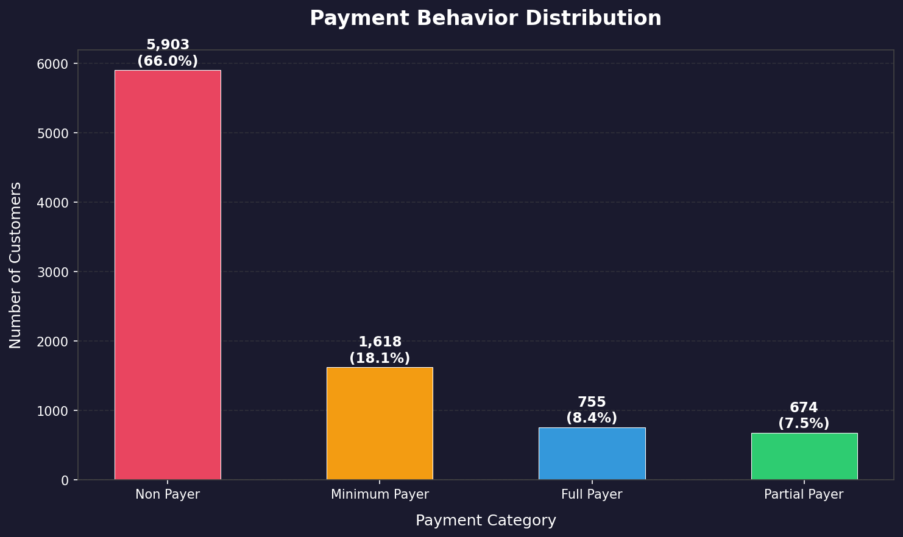
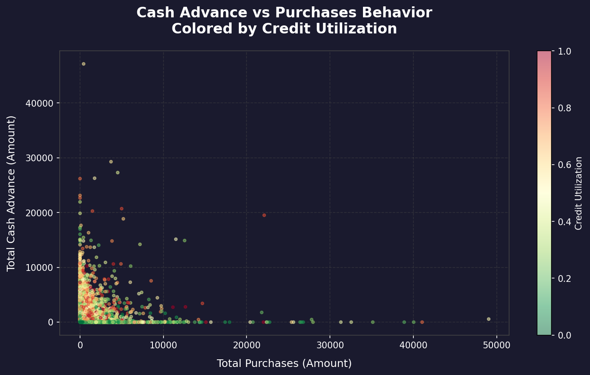
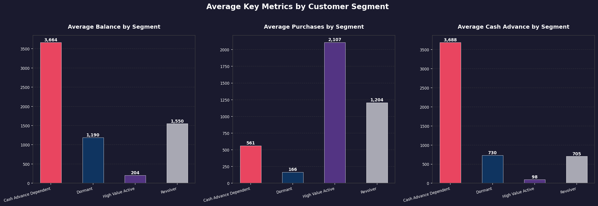

# 💳 Credit Card Customer Intelligence Analysis
### A Business Analytics Deep Dive into Spending Behavior, Risk Profiling and Growth Opportunities
.png)


---
## 📌 Business Problem
A credit card company wants to understand their 8,950 customers better to:
- Identify high value customers for premium card targeting
- Detect high risk customers showing signs of default
- Find growth opportunities in underutilized segments
- Reduce churn by identifying and reactivating dormant customers

---

## 📂 Dataset
- **Source:** Credit Card Dataset for Clustering (Kaggle - Arjun Bhasin)
- **Size:** 8,950 customers | 18 variables
- **Type:** Real-world credit card transaction and behavioral data
- **Key Variables:** Balance, Purchases, Cash Advance, Credit Limit, Payment Behavior, Tenure

---

## 🔧 Tools & Technologies
- **Python 3.11** — Core programming language
- **Pandas** — Data manipulation and cleaning
- **NumPy** — Numerical computations
- **Matplotlib** — Data visualization
- **VS Code + Jupyter Notebook** — Development environment

---

## 📊 Analysis Approach

### 1. Data Cleaning & Preparation
- Handled missing values in CREDIT_LIMIT (filled with median) and MINIMUM_PAYMENTS (filled with 0)
- Removed CUST_ID as non-analytical identifier
- Detected and capped credit utilization outliers above 100%

### 2. Feature Engineering
Created two new business-critical metrics:
- **Credit Utilization Rate** = Balance / Credit Limit
- **Payment Ratio** = Payments / (Minimum Payments + 1)

### 3. Customer Segmentation
Designed four behavioral segments based on purchase frequency and payment behavior:
- **Revolver** — Regular users who carry a balance
- **Dormant** — Inactive customers with low engagement
- **Cash Advance Dependent** — High risk cash withdrawal users
- **High Value Active** — Full payers with healthy spending habits

---

## 📈 Key Findings

| Segment | Customers | Percentage | Avg Balance | Avg Purchases |
|---|---|---|---|---|
| Revolver | 5,054 | 56.47% | 1,550 | 1,204 |
| Dormant | 1,943 | 21.71% | 1,190 | 561 |
| Cash Advance Dependent | 1,000 | 11.17% | 3,664 | 166 |
| High Value Active | 953 | 10.65% | 204 | 2,107 |

### Segment Distribution


### Credit Utilization Analysis


### Payment Behavior Analysis


### Cash Advance vs Purchases


### Segment Metrics Comparison


---

## 💡 Business Recommendations

**1. Convert Revolvers to Full Payers**
Launch targeted financial wellness programs and payment incentives to move the 56% Revolver segment toward healthier payment behavior.

**2. Monitor and Manage Cash Advance Dependent Customers**
Flag 1,000 high risk customers for credit monitoring. Offer alternative products like personal loans to reduce cash advance dependency.

**3. Retain and Grow High Value Active Customers**
Invest in premium rewards, exclusive benefits, and credit limit increases for the 953 ideal customers to drive higher spending volume.

**4. Reactivate Dormant Customers**
Launch personalized re-engagement campaigns for 1,943 dormant customers before they cancel their cards.

**5. Leverage Low Utilization Customers for Growth**
Offer targeted credit limit increases to low utilization customers to drive spending growth without increasing risk.

---

## 📁 Project Structure
```
credit-card-customer-analysis/
├── analysis.ipynb          # Main analysis notebook
├── CC GENERAL.csv          # Dataset
├── segment_distribution.png
├── credit_utilization.png
├── payment_behavior.png
├── cash_advance_vs_purchases.png
├── segment_metrics.png
└── README.md
```

---

## 🚀 How to Run
1. Clone the repository
2. Install required libraries: `pip install pandas numpy matplotlib`
3. Open `analysis.ipynb` in VS Code or Jupyter Notebook
4. Run all cells sequentially

---

## 👤 Author
**Harsh Bhatt**
- BCA Final Year | DSEU Ambedkar Shakarpur Campus
- CGPA: 9.2/10
- [LinkedIn](https://www.linkedin.com/in/harsh-bhatt-2275182b0/) | [GitHub](https://github.com/harshbhatt1600)